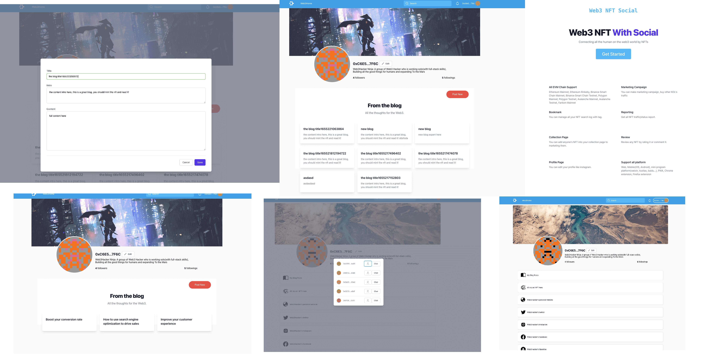

## Web3NFT.Social

* Online demo: [Online link](https://moonbasealpha.web3nft.social/0xC6E58fb4aFFB6aB8A392b7CC23CD3feF74517F6C)
* Video demo: [Video link](#)
* Keynote(pdf version): [Keynote in pdf link](./keynote.pdf)
* Keynote(markdown version): [Keynote in markdown link](./BP.md)
* Screenshot list: [Click to view](./screenshot/)

## Application Features

* User can pay monthly for creator
  * via OAK SDK Turing-Staging
  * [source code](.src/components/web3/nft/btn/Subscribe.vue)
* Blog: user creation for sale [source code](./src/components/web3/nft/article/Form.vue)
  * list/create blog posts, save in IPFS
  * With LIT to have content permission control (user must mint poster's NFT to have access to the article) [source code](./src/helpers/litHelper.ts)
  * blog content can add token gating logic (only user have special NFT can read the blog content) [source code](./src/pages/web3nft.social/%5BuserWalletAddress%5D/blog/%5Bid%5D.vue)
  * readers can mint NFT for creator (Moonbase Aplpha testnet)
    * [FE code](./src/components/web3/nft/btn/MintNFT.vue)
    * [NFT Contract Code](./contracts/CTC_ERC721A.sol)
  * readers can voteUp/voteDown for creator  (Moonbase Aplpha testnet)
    * [FE code](./src/components/web3/nft/btn/VoteUpDown.vue)
    * [Voting Contract Code](./contracts/CrowdFunding.sol)
* Social relations: CyberConnect
  * Follow/unfollow actions [source code](./src/components/web3/nft/btn/Follow.vue)
  * Followers list  [source code](./src/components/web3/nft/dialog/relationshipList.vue)
  * Followings list [source code](./src/components/web3/nft/dialog/relationshipList.vue)
* Web3 LinkTree  [source code](./src/pages/web3nft.social/settings/Web3Home.vue)
  * User can add many social platform link to their W3NS home page
  * Data store on IPFS
  * Data permission control by LIT
* Search any address to show the Web3 things

## 应用功能

* 用户可以按月支付给创作者
  * 通过 OAK SDK Turing-Staging 网络
  * [source code](.src/components/web3/nft/btn/Subscribe.vue)
* Blog: 用户创作经济 [source code](./src/components/web3/nft/article/Form.vue)
  * 列出/创建博客内容，保存到 IPFS
  * 结合 LIT 来可以让内容具有链上权限控制功能(用户必须购买作者指定的 NFT 才能看到博客内容）
  * 博客内容添加了 token 网关功能逻辑（只有用户用特定的 NFT 才能阅读博客内容）[source code](./src/pages/web3nft.social/%5BuserWalletAddress%5D/blog/%5Bid%5D.vue)
  * 读者可以 mint 创作者的 NFT  (Moonbase Aplpha testnet)
    * [FE code](./src/components/web3/nft/btn/MintNFT.vue)
    * [NFT Contract Code](./contracts/CTC_ERC721A.sol)
  * 读者可以给创作者投票 voteUp/voteDown  (Moonbase Aplpha testnet)
    * [FE code](./src/components/web3/nft/btn/VoteUpDown.vue)
    * [Voting Contract Code](./contracts/CrowdFunding.sol)
* 社交关系：CyberConnect
  * 关注/取关功能 [source code](./src/components/web3/nft/btn/Follow.vue)
  * 用户粉丝列表 [source code](./src/components/web3/nft/dialog/relationshipList.vue)
  * 用户关注列表 [source code](./src/components/web3/nft/dialog/relationshipList.vue)
* Web3 LinkTree [source code](./src/pages/web3nft.social/settings/Web3Home.vue)
  * 用户可以添加多个社交平台链接到他们的主页
  * 数据存储在 IPFS
  * 数据读取权限可以用 LIT 控制
* 搜索任何地址显示 web3 相关内容

## Technologies used

* BlockChain Network
  * [x] Moonbase Alpha testnet: mint NFT and voting contract
  * [x] Rinkeby (Opensea NFT)
  * [x] OAK: Turing-Staging
* Smart Contract Dev Env
  * [x] Hardhat
* RPC endpoints
  * [x] Infura
* Front-end hosting && image assets && CDN
  * [x] Vercel
  * [x] IPFS
* User profiles / Blog posts store / Albumn Store / Permission Control
  * [x] IPFS
  * [x] LIT
* Social Graph
  * [x] CyberConnect
* Chat
  * [x] XMTP
* Application Tech Stack
  * [x] TailwindCSS
  * [x] Vue3
  * [x] Pinia (state store)
  * [x] PWA
  * [x] Vue-i18n
  * [x] Villus (gql && pinia binding lib)
  * [x] Vite2
  

